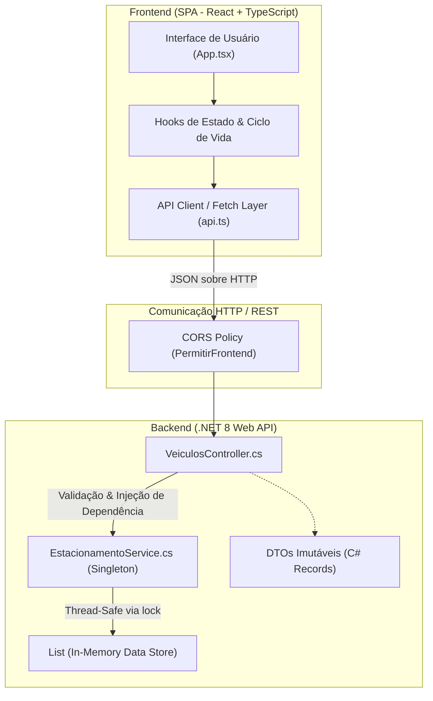

<div align="center">

# 🚗 SmartPark — Sistema de Gestão de Estacionamento

### *Solução Full Stack de Alto Desempenho para Controle e Tarifação de Pátio em Tempo Real*

[](https://dotnet.microsoft.com/)
[](https://dotnet.microsoft.com/apps/aspnet)
[](https://learn.microsoft.com/dotnet/csharp/)
[](https://react.dev/)
[](https://www.typescriptlang.org/)
[](https://vitejs.dev/)
[](http://localhost:5209/swagger)
[](LICENSE)

<br />

[Visão Geral](#-visão-geral) •
[Diferenciais](#-diferenciais-e-recursos-de-mercado) •
[Arquitetura](#-arquitetura-e-engenharia-de-software) •
[Endpoints da API](#-documentação-da-api-restful) •
[Regras de Cobrança](#-motor-de-tarifação-e-regras-de-negócio) •
[Como Rodar](#-guia-de-instalação-e-execução) •
[Stack Tecnológica](#-stack-tecnológica)

---

</div>

## 📌 Visão Geral

O **SmartPark** é um sistema corporativo completo para administração e tarifação de estacionamentos rotativos. Desenvolvido sob rigorosos padrões de engenharia de software, o projeto combina um backend robusto em **ASP.NET Core 8 Web API** com garantia de integridade concorrente (*Thread-Safety*) e um frontend moderno, reativo e intuitivo em **React 18**, **TypeScript** e **Vite**.

Inspirado na usabilidade dos melhores terminais físicos de autopátio, o sistema oferece gestão de capacidade em tempo real, cálculo automatizado de estadias com tarifação fracionada, emissão de tickets estilizados e cupom fiscal térmico formatado para impressão instantânea.

> [!NOTE]
> Este projeto foi projetado com foco em **Clean Code**, **Domain Separation**, contratos de dados imutáveis (**C# Records**) e experiência de usuário de nível comercial.

---

## 🌟 Diferenciais e Recursos de Mercado

### ⚡ Concorrência e Confiabilidade (Backend)
- **Operações Thread-Safe**: O serviço de estacionamento utiliza primitivas de sincronização (`lock`) para assegurar atomicidade nas operações de entrada, saída e consulta, prevenindo *race conditions* sob acessos concorrentes.
- **Ciclo de Vida Singleton Gerenciado**: Persistência consistente de estado em memória durante toda a execução da aplicação.
- **Códigos de Resposta HTTP Semânticos**: Uso estrito do padrão RESTful com retornos granulares (`200 OK`, `201 CreatedAtAction`, `404 NotFound` e `409 Conflict` acompanhados de payload estruturado de erro).
- **Documentação Viva com OpenAPI / Swagger**: Inspeção e teste iterativo de contratos diretamente no navegador.

### 🎨 Experiência do Usuário & Design System (Frontend)
- **Metáfora Real de Pátio Automotivo**:
  - **Letreiro Digital Luminoso**: Painel no topo exibindo vagas livres e status operacional com transições visuais dinâmicas.
  - **Barra de Ocupação Reativa**: Termômetro de capacidade com cálculo percentual e gatilhos de cor por criticidade (🟢 Verde: <60%, 🟡 Amarelo: 60-89%, 🔴 Vermelho: ≥90%).
  - **Cards com Picote de Ticket**: Cada veículo estacionado é apresentado com visual de bilhete de cancela, contendo hora de entrada e tempo decorrido em tempo real.
  - **Cupom Fiscal Térmico**: Recibo de saída detalhado com tempo líquido, quebra tarifária e estilização dedicada para impressão física (`@media print`).
- **Validação e Normalização de Placas**: Sanitização em tempo real de caracteres alfanuméricos com suporte aos padrões **Mercosul** (`ABC1D23`) e **Tradicional** (`ABC-1234`).
- **Estimativa Preditiva de Tarifa**: Cálculo no cliente do valor acumulado antes mesmo de realizar a baixa do veículo.
- **Sincronização Ativa & Modo Resiliente**: Atualização automática por *polling* a cada 6 segundos, relógio de permanência a cada 10 segundos e indicador visual de perda de conexão (modo offline).
- **Busca e Filtragem Instantânea**: Localização rápida de veículos por placa ou modelo tanto no pátio ativo quanto no histórico geral.

---

## 🏛️ Arquitetura e Engenharia de Software

O ecossistema segue o desacoplamento de responsabilidades entre cliente e servidor com uma arquitetura multicamadas bem delineada:



### Padrões e Práticas Aplicadas
1. **Controller-Service Pattern**: Os controladores limitam-se a orquestrar requisições e respostas HTTP, delegando todas as validações de domínio e regras de negócio para a camada de serviço.
2. **Data Transfer Objects (DTOs)**: Modelagem através de `record` types do C# (`NovoVeiculoRequest`, `VeiculoResponse`, `SaidaResponse`, `VagasResponse`, `ErroResponse`), garantindo imutabilidade e integridade contratual.
3. **Type-Safe Frontend**: Tipagem integral espelhada entre backend e frontend através do TypeScript (`types.ts`), minimizando riscos de inconsistência estrutural.

---

## 📡 Documentação da API (RESTful)

A API disponibiliza endpoints RESTful intuitivos sob o prefixo `/api/veiculos`:

| Método | Endpoint | Status Sucesso | Descrição |
| :--- | :--- | :---: | :--- |
| `GET` | `/api/veiculos` | `200 OK` | Lista todos os veículos atualmente estacionados no pátio. |
| `GET` | `/api/veiculos/historico` | `200 OK` | Retorna o histórico completo de movimentações (entradas e saídas). |
| `GET` | `/api/veiculos/vagas` | `200 OK` | Informa capacidade total, vagas ocupadas e vagas disponíveis. |
| `POST` | `/api/veiculos` | `201 Created` | Registra a entrada de um veículo no pátio. |
| `DELETE` | `/api/veiculos/{placa}` | `200 OK` | Registra a saída, calcula permanência e retorna o valor cobrado. |

### Exemplos de Requisição e Resposta

#### 1. Entrada de Veículo (`POST /api/veiculos`)

**Request Body:**
```json
{
  "placa": "BRA2E19",
  "modelo": "Civic Touring"
}
```

**Response (`201 Created`):**
```json
{
  "placa": "BRA2E19",
  "modelo": "Civic Touring",
  "horaEntrada": "2026-09-14T20:15:00.000Z",
  "horaSaida": null,
  "estacionado": true
}
```

> [!WARNING]
> Caso a placa já esteja no pátio ou o estacionamento atinja o limite de 20 vagas, a API responderá com `409 Conflict` contendo `{ "mensagem": "..." }`.

#### 2. Saída e Tarifação (`DELETE /api/veiculos/{placa}`)

**Response (`200 OK`):**
```json
{
  "placa": "BRA2E19",
  "horaEntrada": "2026-09-14T20:15:00.000Z",
  "horaSaida": "2026-09-14T22:30:00.000Z",
  "tempoPermanecido": "2h 15min",
  "valorCobrado": 16.00
}
```

---

## 💰 Motor de Tarifação e Regras de Negócio

O cálculo de permanência é executado no encerramento da comanda pelo backend (`EstacionamentoService.cs`):

$$\text{Valor Total} = \begin{cases} R\$\ 8,00, & \text{se } \text{duração} \le 1\text{ hora} \\ R\$\ 8,00 + \lceil \text{duração} - 1 \rceil \times R\$\ 4,00, & \text{se } \text{duração} > 1\text{ hora} \end{cases}$$

| Período de Permanência | Regra Aplicada | Total Cobrado |
| :--- | :--- | :---: |
| **Até 60 minutos** | Primeira hora ou fração (tarifa base) | **R$ 8,00** |
| **1h 01min até 2h 00min** | 1ª hora (R$ 8,00) + 1 hora adicional (R$ 4,00) | **R$ 12,00** |
| **2h 01min até 3h 00min** | 1ª hora (R$ 8,00) + 2 horas adicionais (2 × R$ 4,00) | **R$ 16,00** |
| **Frações adicionais** | Cobrança proporcional arredondada para cima (`Math.Ceiling`) | **+ R$ 4,00 / hora** |

---

## 🛠️ Stack Tecnológica

<table align="center">
  <tr>
    <td align="center" width="33%">
      <h4>Backend</h4>
      <br/><br/>
      <b>.NET 8 SDK</b><br/>
      ASP.NET Core Web API<br/>
      Swagger / OpenAPI<br/>
      In-Memory Concurrent Store
    </td>
    <td align="center" width="33%">
      <h4>Frontend</h4>
      <br/><br/>
      <b>React 18 & TypeScript</b><br/>
      Vite Bundler<br/>
      Modern Vanilla CSS3<br/>
      Media Print Stylesheet
    </td>
    <td align="center" width="33%">
      <h4>DevOps & Ferramentas</h4>
      <br/><br/>
      <b>Git & GitHub</b><br/>
      Batch Script Automation<br/>
      Visual Studio / VS Code<br/>
      REST Client
    </td>
  </tr>
</table>

---

## 📂 Estrutura do Projeto

```text
Sistema-para-um-Estacionamento-com-C-
├── EstacionamentoApi/                    # Backend (.NET 8 Web API)
│   ├── Controllers/
│   │   └── VeiculosController.cs         # Endpoints REST e controle de fluxo HTTP
│   ├── Models/
│   │   ├── Veiculo.cs                    # Entidade de domínio
│   │   └── Dtos.cs                       # Contratos imutáveis de Request e Response
│   ├── Services/
│   │   └── EstacionamentoService.cs      # Regras de negócio, tarifação e thread-safety
│   ├── EstacionamentoApi.csproj          # Configurações do projeto e dependências .NET
│   └── Program.cs                        # Bootstrapping, DI, CORS e Swagger
│
├── estacionamento-frontend/              # Frontend SPA (React + TypeScript + Vite)
│   ├── src/
│   │   ├── App.tsx                       # Dashboard, formulários, tickets e modais
│   │   ├── App.css                       # Design system, animações e estilo de impressão
│   │   ├── api.ts                        # Camada de integração com a API backend
│   │   ├── types.ts                      # Interfaces e tipos TypeScript estritos
│   │   └── main.tsx                      # Ponto de entrada React DOM
│   ├── index.html                        # Base HTML5 com viewport responsivo
│   ├── package.json                      # Scripts e dependências Node
│   └── vite.config.ts                    # Configuração de build e plugins Vite
│
├── iniciar.bat                           # Script Windows para inicialização paralela em 1 clique
└── README.md                             # Documentação técnica e apresentação do projeto
```

---

## 🚀 Guia de Instalação e Execução

### Pré-requisitos
- [.NET 8.0 SDK](https://dotnet.microsoft.com/download/dotnet/8.0) ou superior instalado
- [Node.js 18+](https://nodejs.org/) e npm instalados
- [Git](https://git-scm.com/) configurado

---

### Opção 1: Inicialização em 1 Clique (Windows) ⚡

O projeto inclui um script automatizado que restaura e sobe ambas as camadas simultaneamente em terminais separados:

```cmd
.\iniciar.bat
```

> [!TIP]
> Você também pode simplesmente dar **duplo clique** no arquivo `iniciar.bat` no Windows Explorer!

---

### Opção 2: Execução Manual Passo a Passo 💻

#### Passo 1 — Executar o Backend (API)

```bash
# Navegue até o diretório da API
cd EstacionamentoApi

# Restaure os pacotes e execute o servidor
dotnet restore
dotnet run
```
A API iniciará no endereço `http://localhost:5209`. O painel interativo do Swagger estará disponível em:
👉 **`http://localhost:5209/swagger`**

#### Passo 2 — Executar o Frontend (React)

Abra um novo terminal e execute:

```bash
# Navegue até o diretório do frontend
cd estacionamento-frontend

# Instale as dependências
npm install

# Inicie o servidor de desenvolvimento
npm run dev
```
O frontend iniciará no endereço `http://localhost:5173`. Acesse no seu navegador:
👉 **`http://localhost:5173`**

---

## 📋 Checklist de Qualidade e Boas Práticas

- [x] **Arquitetura Desacoplada**: Separação total entre lógica de apresentação e regras de negócio.
- [x] **Segurança Concorrente**: Sem risco de inconsistência de estado ou sobreposição de vagas em memória.
- [x] **Resiliência a Falhas**: Tratamento elegante de indisponibilidade de rede no frontend.
- [x] **Acessibilidade e UX**: Foco em contraste visual, feedback imediato e prevenção de ações destrutivas acidentais.
- [x] **Pronto para Impressão**: Layout térmico que oculta elementos de tela via `@media print` para uso em impressoras fiscais/recibos.

---

## 👤 Autor

Desenvolvido por **Higor Lima / Wallace** como projeto de excelência técnica para portfólio profissional.

<div align="left">

[](https://github.com/HigorLima029)
[](https://www.linkedin.com/)
[](mailto:wallace.wcs83@gmail.com)

</div>

---

<div align="center">
  <sub>⭐ Se este projeto foi útil para você ou agregou conhecimento, considere deixar uma estrela no repositório!</sub>
</div>
